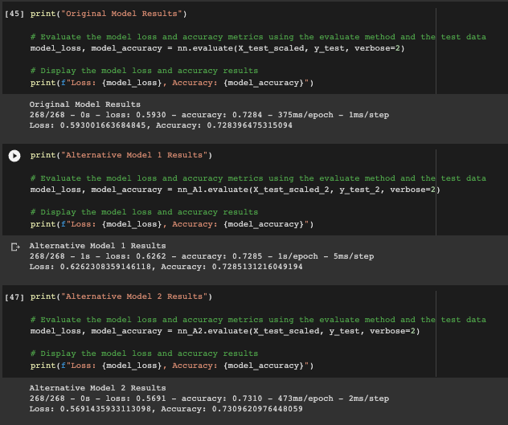

# Challenge_13

# **Deep Learning Model for Venture Capital**

This notebook is a deep learning model to analyze funding applications and predict success or failure of the applying organization based on historical data.  Three attempts were made to optimize the model:

* Model 1
    * All data features
    * 2 hidden layers with 8 & 4 nodes
* Model 2
    * Reduced data features
    * 2 hidden laters with 8 & 4 nodes
* Model 3
    * All data features
    * 3 hidden layers with 16, 8, and 4 nodes

---

# **Technologies**

This application is a Jupyter Notebook and makes use of the Scikit-Learn, TensorFlow, and Keras libraries for data preperation and modelling algorithms. These can be installed with the following commands: 

---

# **Installation Guide**

Before running the application you need to import the following modules:
```python
import pandas as pd
import tensorflow as tf
from tensorflow.keras.layers import Dense
from tensorflow.keras.models import Sequential
from sklearn.model_selection import train_test_split
from sklearn.preprocessing import StandardScaler,OneHotEncoder
```

---

# **Usage**
## Performance metrics for 3 models



---

# **Contributors**

Developed by:

Matthew Crater

[Linked In](https://www.linkedin.com/in/matt-crater/)

---

# **License**

MIT